<div align="center">

<!-- Header animado -->


<p align="center">
  
</p>

<!-- Badges de Status em tempo real -->
<p>
  
  
  
</p>

</div>

---


### 👨‍💻 **SOBRE MIM**

```typescript
const developer = {
    name: "VANESSA RAFAELLA",
    role: "Full Stack Developer",
    education: {
        
        university: "UNICAP - UNIVERSIDADE CATOLICA DE PERNAMBUCO",
    },
    code: ["JavaScript", "TypeScript", "Python", "Java"],
    askMeAbout: ["web dev", "tech", "architecture", "optimization"],
    technologies: {
        frontEnd: {
            js: ["React", "Next.js"],
            css: ["Tailwind", "Chakra UI", "Styled Components"]
        },
        backEnd: {
            js: ["Node.js", "Express"],
            python: ["Django", "FastAPI"],
            java: ["Spring Boot"]
        },
        databases: ["MySQL", "PostgreSQL", "MongoDB", "Redis"],
        devOps: ["Docker", "AWS", "CI/CD", "Kubernetes"],
        tools: ["Git", "Jest", "Webpack", "Vite"]
    },
    architecture: ["Microservices", "Event-Driven", "REST APIs", "GraphQL"],
    currentFocus: "Building scalable and performant applications",
    funFact: "Debugar é como ser um detetive em um filme de crime onde você também é o assassino"
};
```

<br clear="both">

---

<div align="center">

## 🎯 **ARSENAL TECNOLÓGICO**

### **Frontend Development**


### **Backend & Database**


### **DevOps & Tools**


### **Testing & Quality**


</div>

---

<div align="center">

## 📊 **PERFORMANCE METRICS**

<!-- Stats Cards em Grid -->
<table>
  <tr>
    <td width="50%">
      
    </td>
    <td width="50%">
      
    </td>
  </tr>
  <tr>
    <td colspan="2">
      
    </td>
  </tr>
</table>

<!-- Most Used Languages com visual aprimorado -->


</div>

---

<div align="center">

## 🏆 **CONQUISTAS & TROFÉUS**


</div>

---

## 💼 **PROJETOS DE DESTAQUE**

<div align="center">

<!-- Cards de Projetos -->
<table>
  <tr>
    <td width="50%">
      <a href="https://github.com/VANESSENCEWEB/PROJETO1">
        
      </a>
    </td>
    <td width="50%">
      <a href="https://github.com/VANESSENCEWEB/PROJETO2">
        
      </a>
    </td>
  </tr>
  <tr>
    <td width="50%">
      <a href="https://github.com/VANESSENCEWEBE/PROJETO3">
        
      </a>
    </td>
    <td width="50%">
      <a href="https://github.com/VANESSENCEWEB/PROJETO4">
        
      </a>
    </td>
  </tr>
</table>

</div>

---

<div align="center">

## 🎨 **O QUE EU FAÇO**

```mermaid
graph LR
    A[💡 Ideia] -->|Análise| B[📋 Planejamento]
    B -->|Design| C[🎨 UI/UX]
    C -->|Desenvolvimento| D[⚙️ Backend]
    C -->|Desenvolvimento| E[🖥️ Frontend]
    D -->|Integração| F[🔗 API]
    E -->|Integração| F
    F -->|Testes| G[✅ Quality Assurance]
    G -->|Deploy| H[🚀 Produção]
    H -->|Monitoramento| I[📊 Analytics]
    I -->|Melhoria| A
```



</div>

---

## 📈 **MÉTRICAS DE CÓDIGO**

<div align="center">

<!-- WakaTime Stats (se você usar) -->


<!-- Atividade de Commit por hora -->


</div>

---

<div align="center">

## 🌐 **CONECTE-SE COMIGO**

<p>
  <a href="https://linkedin.com/in/vanessarafaella" target="_blank">
    
  </a>
  <a href="mailto: imvanessarafaella@gmail.com" target="_blank">
    
  </a>
  <a href="https://instagram.com/SEU_INSTAGRAM" target="_blank">
    
  </a>
  <a href="https://twitter.com/SEU_TWITTER" target="_blank">
    
  </a>
  <a href="https://dev.to/SEU_DEVTO" target="_blank">
    
  </a>
  <a href="SEU_PORTFOLIO.com" target="_blank">
    
  </a>
</p>

### 💬 **Code is like humor. When you have to explain it, it's bad.**

</div>

---

<div align="center">

## 📫 **VAMOS TRABALHAR JUNTOS?**

**Estou aberta a oportunidades desafiadoras e projetos inovadores!**

<p>
  
  
  
</p>

### 📧 **Contato:** [imvanessarafaella@gmail.com](mailto:imvanessarafaella@gmail.com)
### 💼 **LinkedIn:** [linkedin.com/in/vanessarafaella](https://linkedin.com/in/vanessarafaella)

</div>

---

### 🐍 **Contribution Snake**


<div align="center">

<!-- Visitor Counter -->


<!-- Footer animado -->


### ⭐ **Se você gostou do meu perfil, deixe uma estrela nos meus repositórios!** ⭐

**Feito com 💙 e muito ☕**

</div>

